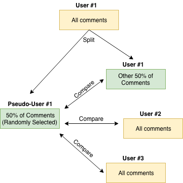
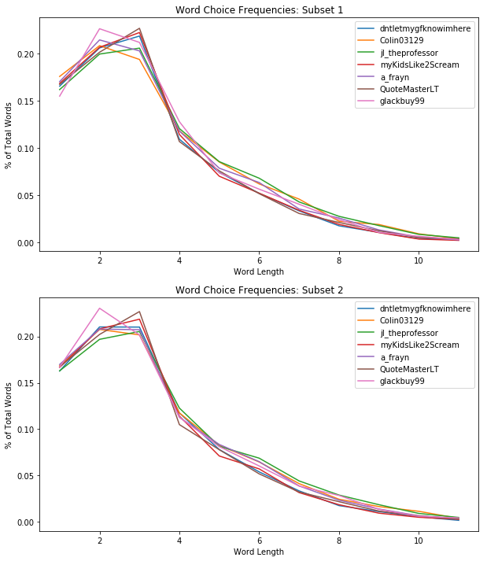
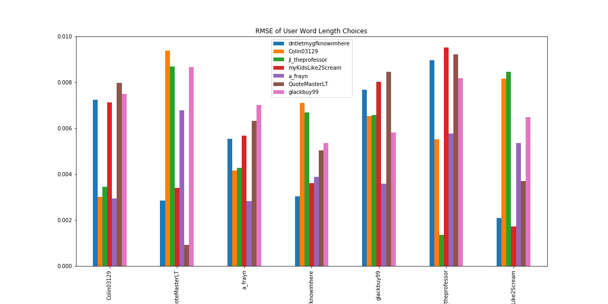
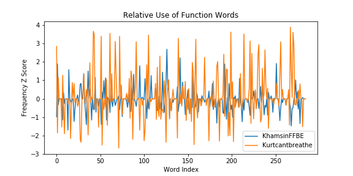
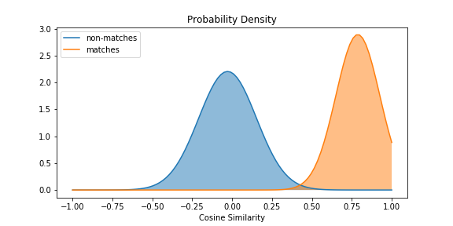

# Identifying Reddit Users Based on Text Style Analysis

## Context

For centuries, authors have been able to write anonymously with the notion that their true identity would never be uncovered. That has all changed in the past few years, however, as machine learning methods have improved the efficacy of stylometry. Stylometry is the study of literary style, and involves identifying an author's writing style by uncovering unique patterns in word choice, sentence structure, punctuation, and more.

Some of the most famous examples of stylometric analysis include its use in identifying James Madison and Alexander Hamilton as the authors of the anonymously written Federalist Papers, successfully tying J.K. Rowling back to the anonymous author of the book, "A Cuckoo's Calling", and determining which Shakespearean plays Shakespeare actually wrote, which ones he co-wrote, and which ones were written by an entirely different person.

But these are all examples of large bodies of text written by professionals. Can stylometry still be effective in an informal setting with a smaller sample of text, such as social media? How few words do we need before we can start to distinguish an author's writing style from another's, and how many authors can we compare a body of anonymously written text to before we start to see two users with indistinguishably similar writing styles?

## Implementation

For this project, I wanted to see if I could answer these questions by analyzing users on Reddit. All users on the site submit posts and comments anonymously under a given username, and everyone's comments are publicly accessible. The only information needed to create a Reddit account is an email, so some users have been known to create multiple accounts. This presents a problem when a user's account is banned from a subreddit for uncivil discussion. They can simply create another account in order to regain subreddit access. Perhaps, if I'm lucky, I can identify two or more accounts that belong to the same user as a way to help subreddit moderators maintain healthier subreddit environments. 

Because this is an unsupervised learning problem, I needed some way to validate the accuracy of my model. To do this, I took a user's entire comment history and randomly pulled out half of their comments, creating a new pseudo-user with these comments. Then I measured my model's success in being able to correctly match this pseudo-user back to the original user those comments were pulled from.

### Baseline

One of the oldest techniques in stylometry dates back to the 1800's, where authors were compared by using the frequencies at which they use words of different lengths. Some tend to use short two and three-letter words more often, while others tend to pull from a larger vocabulary. The technique of using frequencies of these word lengths is commonly called Mendenhall's Characteristic Curves of Composition (MCCC). While fairly crude, this technique can still be used to identify authorship. We can determine whose curve of composition
most closely resembles the curve of the anonymous text by determining the curve with the lowest average RMSE. MCCC was first tested on a small group of 7 randomly chosen Redditors.

By iterating through each pseudo-user in Subset 2 and comparing it to each of the users in Subset 1, MCCC was able to correctly identify 5 of the 7 users. While promising, this technique is too simplistic to be used at scale. 

### Modeling Burrow's Delta

Many NLP applications such as topic modeling typically use TF-IDF to identify rare keywords that can be used to help describe the text. In stylometry, the most important words are actually function words, common words such as "about", "because", and "while". Authors commonly write about a broad range of topics, thus heavily varying the vocabulary they use. However, function words show up in every text, and their frequency of use tends to stay fairly consistent across different documents for a given author

For my analysis, 150 of some of the most commonly used function words were used to identify user writing styles by the Delta method. The frequencies of each function word were recorded and then standardized by subtracting the mean and dividing by the standard deviation, giving each features value the representation of a z-score. The result is a 150-dimensional vector that is positive in a feature dimension where the author uses a word more frequently than the average user, and negative where it is used less than average. The vector of a pseudo-user can then be compared to that of each user most accurately by measure of cosine similarity.

The results were much improved for this method. The 7 users previously analyzed were now matched back to their correct user with 100% accuracy. Identifying users out of a random group of 40 (filtering out those who have less than 200 comments) returned 95% accuracy. 

In addition to lexical analysis, we can also distinguish unique writing styles with syntax. Using nltk's Part-Of-Speech (POS) tagger and skip-grams, I found the 100 most commonly-used POS sequences and vectorized each user's frequency of use for them, as was performed with the function words. This model returned 90% accuracy for the same 40 users. However, by ensembling the two techniques together, I achieved 100% accuracy.

### Scaling Up

By continuing to add random users, while still filtering out any users who have less than 200 comments, the model continued to perfectly predict authorship for up to 100 users. Past this point, accuracy began to slightly deteriorate all the way down to 92.2% when a user was identified out of a pool of 2,000 users.

The reason for this drop in accuracy is mostly attributable to lack of data. All users who had over 1,000 comments were still being predicted with 100% accuracy. It was those with a smaller comment history whom were not as easily identified. I also found that certain users had writing styles that were not very unique; the vast majority of their feature values hovered around the mean. This was the case with user KhasminFFBE shown below. Further, the introduction of more users increases the chance that some users will have highly similar styles of writing. If a user tends to "code switch", i.e. change their style of writing in different contexts, they may be accidentally identified as another user that has very similar writing tendencies. 

To further improve the model, I incoporated into the feature vector the use of punctuation and certain formatting methods that are commonly used on Reddit (such as "\" used to display hyperlinks). I also added a few slang words that are commonly found on social media and that resemble some of the function words from before. These include words like "yeah", "gonna", and "haha". This boosted my model's performance to 93.8% accuracy. 

From the distribution, I was able to determine critical values at which I can reject the null hypothesis that a user is a non-match. Because incorrectly banning a user as a false positive is much more detrimental that determining a false negative, alpha should be as small as possible, but should also be chosen with respect to the total number of users  

| Alpha      |  Cosine Threshold        | Power  |
| :-------------: |:-------------:| :-----:|
| 1%     | 0.542 | 99.29% |
| 0.1%      | 0.597    |  96.65% |
| 0.01% |    0.693   |  75.30%   |

### Final Application

A hierarchical clustering model was used to determine if any of the randomly chosen accounts were in fact authored by a common user. One user's comments were still split for reference and visualization purposes. The dendogram below displays authorship clustering analysis of 40 users. An alpha level of 0.1% was chosen considering there were fairly few users being compared and the chances of finding a false positive are minimal. 

